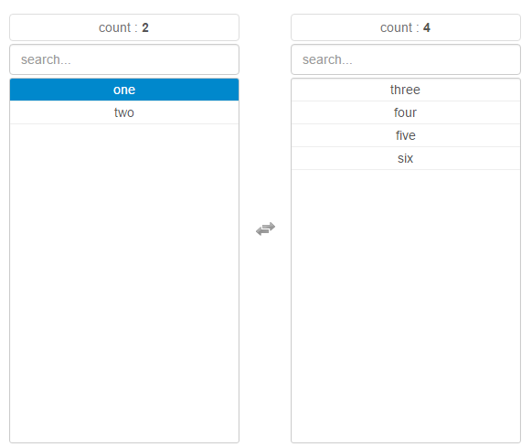

# multi-select-data
基于 [lou/multi-select](https://github.com/lou/multi-select/) 选择控件，在此基础上添加数据绑定，做了进一步封装。



## Demo

[示例网页](https://zhizuqiu.github.io/demo/multi-select-data/)

## Usage

### 引用
除了引用`multi-select`所需的文件，还要额外引入
```html
<script src="./js/jquery.multi-select-data.js"></script>
```

### 占位
将选择框放到合适的位置
```html
<select id='optgroup' multiple='multiple' style="display: none"></select>
```

### 初始化
1. 准备数据，形如：
```javascript
var data = [
    {
        INDEX: '0',
        SELECT: false,
        TEXT: 'one',
        CHANNEL: '0',
        LABEL: 'billing',
        VALID: '0'
    }, {
        INDEX: '1',
        SELECT: false,
        TEXT: 'two',
        CHANNEL: '1',
        LABEL: 'billing',
        VALID: '0'
    }, {
        INDEX: '2',
        SELECT: true,
        TEXT: 'three',
        CHANNEL: '2',
        LABEL: 'billing',
        VALID: '1'
    }
];
```

2. 初始化对象
```javascript
var multiSelect = new MultiSelect($('#optgroup'), 'INDEX', 'TEXT', {name: 'VALID', select: '1'});
```

MultiSelect有四个参数：
1. 第一个参数：DOM元素
2. 第二个参数：对应option的value值的列，请确保此值唯一
3. 第三个参数：对应option的text值得列
4. 第四个参数：初始化时，用于筛选选中数据的对象，例如上方，表示'VALID'值为'1'的option将置入已选中的列表中。

### 回调
1. 选中后的回调事件
```javascript
multiSelect.onEvent('afterSelect',function (values) {});
```

2. 取消选中后的回调事件
```javascript
multiSelect.onEvent('afterDeselect',function (values) {});
```

### 方法
1. 绑定数据
```javascript
multiSelect.init(data)
```

2. 获取原数据
```javascript
multiSelect.getOrigin()
```

3. 清空
```javascript
multiSelect.empty();
```

4. 选中所有
```javascript
multiSelect.selectAll();
```

5. 取消所有
```javascript
multiSelect.unSelectAll();
```

6. 获取相比刚初始化时，仍在选中框的数据
```javascript
multiSelect.getUpdate();
```

7. 获取相比刚初始化时，被取消选中的数据
```javascript
multiSelect.getDelete();
```

8. 获取相比刚初始化时，新选中的数据
```javascript
multiSelect.getAdd();
```

9. 获取全部选择的
```javascript
multiSelect.getSelected();
```

10. 获取全部未选择的
```javascript
multiSelect.getDeselect();
```

注意：getUpdate()、getDelete()、getAdd()三个方法可以传入一个列名为参数，作为`对比条件`，例如
```javascript
multiSelect.getAdd('CHANNEL');
```

表示，根据CHANNEL列，取最终选中列表与初始选中列表的差集，如果不传此值，会把KEY列作为`对比条件`。